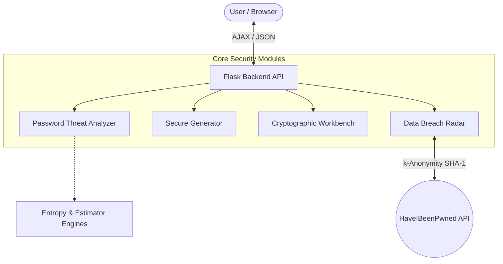

# SecurePass-Intelligence

SecurePass-Intelligence is an interactive, advanced cybersecurity password analyzer, secure generator, leak radar, and cryptographic benchmarking sandbox.

## System Architecture Overview



## Key Features
1. **Password Threat Analyzer**: Analyzes password strength scoring, Shannon entropy ($$H = L \times \log_2(R)$$), guesses/brute force duration estimates ($$\text{Time} = \frac{R^L}{\text{Speed}}$$), structural runs, and leverages AI advisory checks.
2. **Secure Credentials Generator**: Offers a tabbed configuration for cryptographically secure random passwords, multi-word memorable passphrases, and keyword-based passwords with automated leetspeak substitutions.
3. **Data Breach Radar**: Securely queries the HaveIBeenPwned API via k-Anonymity range search to check if a password has been compromised.
4. **Cryptographic Workbench**: Benchmarks and visualizes computation speed and attack cost across algorithms like SHA-256, SHA-512, bcrypt, scrypt, and Argon2id.
5. **Security Intelligence Insights**: Educational summaries on entropy math, key derivation functions, and NIST compliant password guidelines.

## Directory Structure
```
SecurePass-Intelligence/
├── app.py                     # App initialization and entry point
├── config.py                  # Environment variable configuration loader
├── requirements.txt           # Dependency requirements
├── README.md                  # Main overview documentation
├── .gitignore                 # Untracked files configuration
│
├── modules/                   # Security engines and calculators
│   ├── password_analyzer.py
│   ├── strength_calculator.py
│   ├── entropy_calculator.py
│   ├── crack_time_estimator.py
│   ├── risk_engine.py
│   ├── suggestion_engine.py
│   ├── ai_advisor.py
│   ├── password_generator.py
│   ├── breach_checker.py
│   └── utils.py
│
├── hashing/                   # Cryptographic hashing submodules
│   ├── sha256_hash.py
│   ├── sha512_hash.py
│   ├── bcrypt_hash.py
│   ├── scrypt_hash.py
│   └── argon2_hash.py
│
├── services/                  # Business services
│   ├── hibp_service.py
│   ├── graph_service.py
│   └── export_service.py
│
├── datasets/                  # Reference wordlists and pattern rules
│   ├── common_passwords.txt
│   ├── keyboard_patterns.txt
│   ├── sequential_patterns.txt
│   ├── passphrase_words.txt
│   ├── colors.txt
│   ├── animals.txt
│   └── nouns.txt
│
├── routes/                    # Blueprint controllers
│   ├── analysis_routes.py
│   ├── generator_routes.py
│   ├── breach_routes.py
│   ├── hashing_routes.py
│   └── api_routes.py
│
├── templates/                 # Glassmorphic HTML views
│   ├── base.html
│   ├── index.html
│   ├── analysis.html
│   ├── generator.html
│   ├── breach.html
│   ├── hashing.html
│   └── dashboard.html
│
├── static/                    # Frontend assets
│   ├── css/style.css          # Custom dark security cockpit stylesheet
│   ├── js/main.js             # AJAX routes and Chart.js integrations
│
├── tests/                     # Unit test suite
│   ├── test_entropy.py
│   ├── test_strength.py
│   ├── test_generator.py
│   ├── test_breach.py
│   └── test_hashing.py
│
└── docs/                      # Technical manuals
    ├── architecture.md
    ├── threat_model.md
    └── deployment_guide.md
```

## Quick Start
1. Create and activate a Python virtual environment:
   ```bash
   python -m venv .venv
   # Windows PowerShell:
   .\.venv\Scripts\Activate.ps1
   # Unix:
   source .venv/bin/activate
   ```
2. Install required packages:
   ```bash
   pip install -r requirements.txt
   ```
3. Run the development server:
   ```bash
   python app.py
   ```
4. Access the cockpit dashboard at `http://127.0.0.1:5000`.

## Testing
Run the comprehensive `pytest` test suite:
```bash
pytest -v
```

## 📚 Project Documentation
- [System Architecture](docs/architecture.md)
- [Threat Model & Mitigations](docs/threat_model.md)
- [Deployment Guide](docs/deployment_guide.md)
- [Implementation Walkthrough](docs/walkthrough.md)

## ⚠️ Disclaimer
This project is intended for educational purposes and cybersecurity awareness. While the tool generates cryptographically secure passwords and evaluates entropy using established mathematical algorithms, no security system is completely foolproof. The authors are not responsible for any security breaches or data loss that may occur. Always use a combination of strong passwords, hardware security keys, multi-factor authentication (MFA), and safe browsing habits.

## 🤝 Credits
- Data breach queries are powered by the [Have I Been Pwned](https://haveibeenpwned.com/) API via k-Anonymity protocols.
- Developed by **Atharv** for CyberSecurity exploration.
