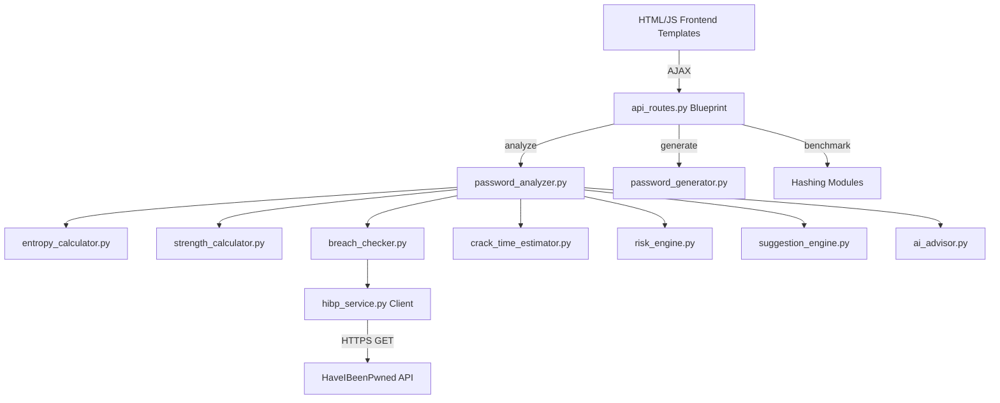

# System Architecture: SecurePass-Intelligence

SecurePass-Intelligence is a modular password evaluation and benchmarking platform designed to demonstrate modern cybersecurity password best practices.

## Modular Component Overview

### 1. Presentation Layer (`templates/` & `static/`)
- **Control Cockpits**: Rendered via Flask templates (`index.html`, `analysis.html`, `generator.html`, `breach.html`, `hashing.html`, `dashboard.html`).
- **Styling**: Managed in `style.css` using slate glassmorphic panels, Outfits typography, and custom variables for semantic feedback.
- **Client Logic (`main.js`)**: Debounces input events, makes AJAX fetch requests to JSON routes, runs clipboards integration, and renders charts via Chart.js.

### 2. Service Layer (`services/`)
- **HIBP Service (`hibp_service.py`)**: Responsible for querying the HaveIBeenPwned range API using the first 5 characters of a password's SHA-1 hash (k-Anonymity privacy technique).
- **Graph Service (`graph_service.py`)**: Formats character categories and creates data grids for line/pie charts.
- **Export Service (`export_service.py`)**: Compiles assessment summaries into JSON and structured plain text files.

### 3. Hashing Sandbox (`hashing/`)
Contains wrappers to benchmark and evaluate:
- Fast hashing: SHA-256 and SHA-512.
- Key Derivation Functions: Bcrypt, Scrypt, and Argon2id.

### 4. Engine & Analysis Modules (`modules/`)
- **Password Analyzer (`password_analyzer.py`)**: Serves as the main orchestrator, collecting all metrics.
- **Entropy Calculator (`entropy_calculator.py`)**: Computes Shannon entropy dynamically.
- **Strength Calculator (`strength_calculator.py`)**: Scores passwords against dictionary lookups, keyboard walk lists, and sequences.
- **Risk Engine (`risk_engine.py`)**: Evaluates overall risk level.
- **AI Advisor (`ai_advisor.py`)**: Fallback expert advice system with optional Google Gemini integration.
