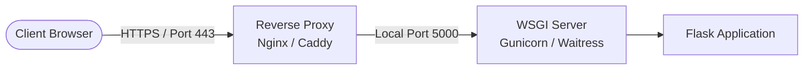

# Deployment Guide: SecurePass-Intelligence

Follow these instructions to configure, run, and deploy the application locally or to production environments.

## Deployment Architecture

The following diagram illustrates the recommended production deployment model.



## 1. Prerequisites
- Python 3.12+ (Python 3.14 is fully supported and recommended on Windows for pre-compiled wheels).
- Pip (updated).

## 2. Local Setup
1. **Initialize virtual environment**:
   ```bash
   python -m venv .venv
   ```
2. **Activate the environment**:
   - Windows PowerShell:
     ```powershell
     .\.venv\Scripts\Activate.ps1
     ```
   - Windows Command Prompt:
     ```cmd
     .\.venv\Scripts\activate.bat
     ```
   - Unix/macOS:
     ```bash
     source .venv/bin/activate
     ```
3. **Install dependencies**:
   ```bash
   pip install -r requirements.txt
   ```

## 3. Environment Variables
Create a `.env` file in the root of the project directory to override default configuration values:
```env
# Flask configuration
SECRET_KEY=your-custom-super-secret-key-goes-here
FLASK_DEBUG=False
PORT=5000

# Optional Google Gemini AI Advisor key
GEMINI_API_KEY=AIzaSy...
```

## 4. Run Application
### Development:
```bash
python app.py
```
This binds to `http://127.0.0.1:5000` with hot-reload enabled.

### Production:
For hosting public-facing instances, do not run Flask directly. Instead, run with a WSGI container:
- **Windows**: Use Waitress:
  ```bash
  pip install waitress
  waitress-serve --port=5000 app:create_app
  ```
- **Unix/Linux**: Use Gunicorn:
  ```bash
  pip install gunicorn
  gunicorn -w 4 -b 127.0.0.1:5000 "app:create_app()"
  ```
