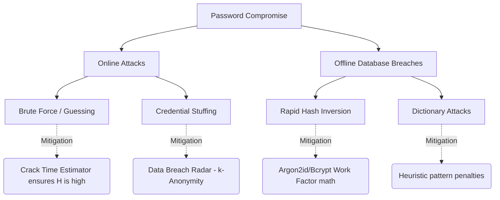

# Threat Model & Cryptographic Mitigations

This document outlines primary threat vectors targeted at user credentials and documents how SecurePass-Intelligence demonstrates mitigation strategies.

## Attack Tree Analysis

The following flowchart outlines the different paths an attacker might take to compromise a system using weak credentials, and how this platform mitigates those vectors.

## 1. Threat Vectors

### A. Online Brute-Force Attacks
- **Description**: An attacker repeatedly attempts to log in to an active service by guessing passwords over the network.
- **Mitigation**: Services limit guess speeds (e.g. 100/sec) and lock accounts after multiple failures. Our **Crack Time Estimator** models this scenario to show why even weak passwords can resist pure online brute-force attacks.

### B. Offline Cracking / Database Leaks
- **Description**: Attackers obtain the database of password hashes (e.g. from an SQL injection breach) and run rapid offline calculations on custom GPU/ASIC hardware.
- **Mitigation**: Using fast hashing algorithms like SHA-256 or MD5 is extremely vulnerable here since a single modern GPU can check billions of combinations per second. Using Key Derivation Functions (like Bcrypt or Argon2id) raises the work cost per guess.

### C. Dictionary Attacks
- **Description**: Attackers run pre-compiled lists of highly common passwords (like RockYou.txt or standard keyboard paths) to check if any user set them.
- **Mitigation**: Our **Strength Calculator** conducts strict dictionary checks against `common_passwords.txt` and keyboard swipe row structures, penalizing matches instantly.

### D. Credential Stuffing
- **Description**: Bots run pairs of emails and passwords leaked in prior breaches to see if they work on other sites.
- **Mitigation**: Our **Breach Radar** uses the secure k-Anonymity HIBP API lookup to identify compromised passwords, urging users to immediately replace them.

---

## 2. Cryptographic Algorithm Comparison

| Mitigation Requirement | SHA-256 | Bcrypt | Argon2id |
| :--- | :--- | :--- | :--- |
| **Salting** | Yes | Yes (Automatic) | Yes |
| **Work Factor Scaling** | No | Yes (Exponential) | Yes (Memory & Time) |
| **Memory Hardness** | No | No | Yes (Prevents ASIC/GPU efficiency) |
| **Parallelism Control** | No | No | Yes (Multi-thread scaling) |
| **Hardware Resistance** | None | Low | High |

## 3. The Mathematics of Key Derivation Functions (KDFs)

To mitigate offline attacks, KDFs artificially inflate the computational cost of verifying a password. 

### Bcrypt
Bcrypt relies on a parameterized cost factor ($$C$$). The total number of internal operations scales exponentially.

$$
\text{Operations} \propto 2^C
$$

If a cost factor of $$C = 12$$ takes 0.3 seconds, increasing it to $$C = 13$$ will take 0.6 seconds. This exponential scaling allows defenders to keep pace with Moore's Law.

### Argon2id
Argon2id is the winner of the Password Hashing Competition. It defends against GPU/ASIC attacks by being **memory-hard**. It accepts three tuning parameters:

1. **$$t$$ (Time Cost)**: The number of iterations.
2. **$$m$$ (Memory Cost)**: The amount of RAM the algorithm is forced to allocate and write to (e.g., 64 MB).
3. **$$p$$ (Parallelism)**: The number of threads required.

The cost to attack Argon2 is modeled as the Time-Memory Tradeoff (TMTO). If an attacker tries to compute the hash using less memory than $$m$$, the time required scales exponentially, heavily penalizing custom ASIC chips that lack large, fast RAM arrays.
