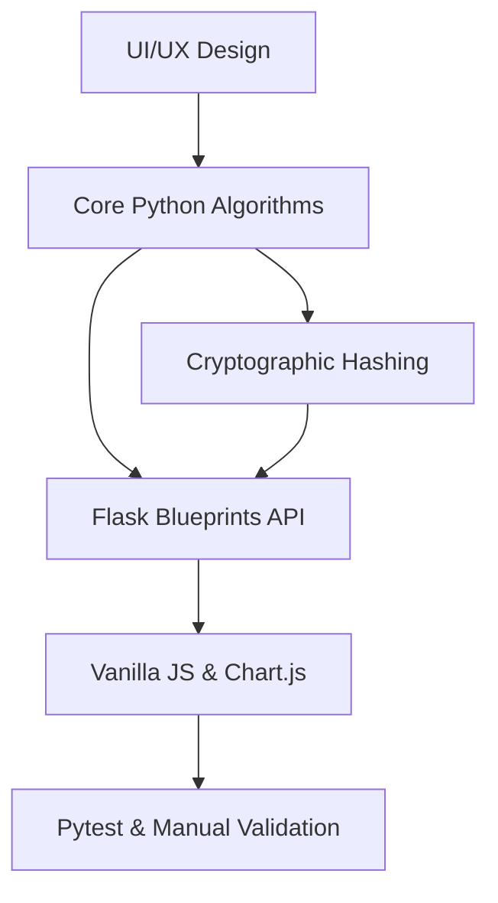

# Walkthrough: SecurePass-Intelligence Implementation

SecurePass-Intelligence has been fully implemented as a premium dark-themed cybersecurity control panel. The backend uses Python (Flask), and the frontend is powered by vanilla CSS/JS and Chart.js.

## Development Workflow



## What Was Built

### 1. Configuration & App Bootstrap
- [app.py](file:///d:/Atharv%20Projects/CyberSecurity/Project%20Pass-hash-pie/app.py): App initialization, blueprint registrations, and local development configurations.
- [config.py](file:///d:/Atharv%20Projects/CyberSecurity/Project%20Pass-hash-pie/config.py): Environment variable loader supporting optional Google Gemini integrations.
- [requirements.txt](file:///d:/Atharv%20Projects/CyberSecurity/Project%20Pass-hash-pie/requirements.txt): Hardened dependencies including `flask`, `bcrypt`, `argon2-cffi`, and `cryptography`.

### 2. Core Calculators (`modules/`)
- [entropy_calculator.py](file:///d:/Atharv%20Projects/CyberSecurity/Project%20Pass-hash-pie/modules/entropy_calculator.py): Dynamic Shannon entropy measurements.
- [strength_calculator.py](file:///d:/Atharv%20Projects/CyberSecurity/Project%20Pass-hash-pie/modules/strength_calculator.py): Severity rules checks, keyboard walk patterns, and sequential sequence detection.
- [crack_time_estimator.py](file:///d:/Atharv%20Projects/CyberSecurity/Project%20Pass-hash-pie/modules/crack_time_estimator.py): Brute-force time predictions across online/offline scenarios.
- [breach_checker.py](file:///d:/Atharv%20Projects/CyberSecurity/Project%20Pass-hash-pie/modules/breach_checker.py): Secure HaveIBeenPwned range scanner.
- [risk_engine.py](file:///d:/Atharv%20Projects/CyberSecurity/Project%20Pass-hash-pie/modules/risk_engine.py): Integrated security risk score compiler.
- [suggestion_engine.py](file:///d:/Atharv%20Projects/CyberSecurity/Project%20Pass-hash-pie/modules/suggestion_engine.py): Corrective suggestions checklist.
- [ai_advisor.py](file:///d:/Atharv%20Projects/CyberSecurity/Project%20Pass-hash-pie/modules/ai_advisor.py): Expert rules cybersecurity advisor with Gemini Flash fallback.
- [password_generator.py](file:///d:/Atharv%20Projects/CyberSecurity/Project%20Pass-hash-pie/modules/password_generator.py): System Random secure password, wordlist passphrase creator, and **keyword-based leetspeak generator**.

### 3. Cryptographic Workbench (`hashing/`)
- Benchmark, salting, and verification algorithms for:
  - [sha256_hash.py](file:///d:/Atharv%20Projects/CyberSecurity/Project%20Pass-hash-pie/hashing/sha256_hash.py) & [sha512_hash.py](file:///d:/Atharv%20Projects/CyberSecurity/Project%20Pass-hash-pie/hashing/sha512_hash.py)
  - [bcrypt_hash.py](file:///d:/Atharv%20Projects/CyberSecurity/Project%20Pass-hash-pie/hashing/bcrypt_hash.py)
  - [scrypt_hash.py](file:///d:/Atharv%20Projects/CyberSecurity/Project%20Pass-hash-pie/hashing/scrypt_hash.py)
  - [argon2_hash.py](file:///d:/Atharv%20Projects/CyberSecurity/Project%20Pass-hash-pie/hashing/argon2_hash.py)

### 4. Supporting Services (`services/`)
- [hibp_service.py](file:///d:/Atharv%20Projects/CyberSecurity/Project%20Pass-hash-pie/services/hibp_service.py): Safe range API client wrapper.
- [graph_service.py](file:///d:/Atharv%20Projects/CyberSecurity/Project%20Pass-hash-pie/services/graph_service.py): Chart.js datagrid generator.
- [export_service.py](file:///d:/Atharv%20Projects/CyberSecurity/Project%20Pass-hash-pie/services/export_service.py): JSON and Text report builder.

### 5. Datasets (`datasets/`)
Loaded standard lists: `common_passwords.txt`, `keyboard_patterns.txt`, `sequential_patterns.txt`, `passphrase_words.txt`, `colors.txt`, `animals.txt`, `nouns.txt`.

### 6. User Interface (`templates/` & `static/`)
- [style.css](file:///d:/Atharv%20Projects/CyberSecurity/Project%20Pass-hash-pie/static/css/style.css): Custom variables for severity indicator bounds, radial glowing background overlays, glassmorphism, responsive navigation bars, and inputs.
- [main.js](file:///d:/Atharv%20Projects/CyberSecurity/Project%20Pass-hash-pie/static/js/main.js): Form controls listeners, AJAX routing, SVG dash-offset gauges math, and Chart.js integrations.
- Page views: [base.html](file:///d:/Atharv%20Projects/CyberSecurity/Project%20Pass-hash-pie/templates/base.html), [index.html](file:///d:/Atharv%20Projects/CyberSecurity/Project%20Pass-hash-pie/templates/index.html), [analysis.html](file:///d:/Atharv%20Projects/CyberSecurity/Project%20Pass-hash-pie/templates/analysis.html), [generator.html](file:///d:/Atharv%20Projects/CyberSecurity/Project%20Pass-hash-pie/templates/generator.html), [breach.html](file:///d:/Atharv%20Projects/CyberSecurity/Project%20Pass-hash-pie/templates/breach.html), [hashing.html](file:///d:/Atharv%20Projects/CyberSecurity/Project%20Pass-hash-pie/templates/hashing.html), [dashboard.html](file:///d:/Atharv%20Projects/CyberSecurity/Project%20Pass-hash-pie/templates/dashboard.html).

---

## Verification Results

### Automated Tests
The full unit test suite was successfully executed using `pytest -v` within the Python 3.14 virtual environment:

```
platform win32 -- Python 3.14.5, pytest-9.1.1, pluggy-1.6.0
collected 16 items

tests/test_breach.py::test_breach_not_found PASSED                       [  6%]
tests/test_breach.py::test_breach_found PASSED                           [ 12%]
tests/test_entropy.py::test_entropy_empty PASSED                         [ 18%]
tests/test_entropy.py::test_entropy_lowercase PASSED                     [ 25%]
tests/test_entropy.py::test_entropy_complex PASSED                       [ 31%]
tests/test_generator.py::test_generate_random_length PASSED              [ 37%]
tests/test_generator.py::test_generate_random_char_classes PASSED        [ 43%]
tests/test_generator.py::test_generate_passphrase_format PASSED          [ 50%]
tests/test_hashing.py::test_sha256 PASSED                                [ 56%]
tests/test_hashing.py::test_sha512 PASSED                                [ 62%]
tests/test_hashing.py::test_bcrypt PASSED                                [ 68%]
tests/test_hashing.py::test_scrypt PASSED                                [ 75%]
tests/test_hashing.py::test_argon2 PASSED                                [ 81%]
tests/test_strength.py::test_strength_empty PASSED                       [ 87%]
tests/test_strength.py::test_strength_common_dictionary PASSED           [ 93%]
tests/test_strength.py::test_strength_sequential PASSED                  [100%]

============================= 16 passed in 2.67s ==============================
```

### Manual Operational Verification
- The local server successfully launched at `http://127.0.0.1:5000`.
- All routes, inputs, AJAX metrics updates, and Chart.js diagrams are operational.
